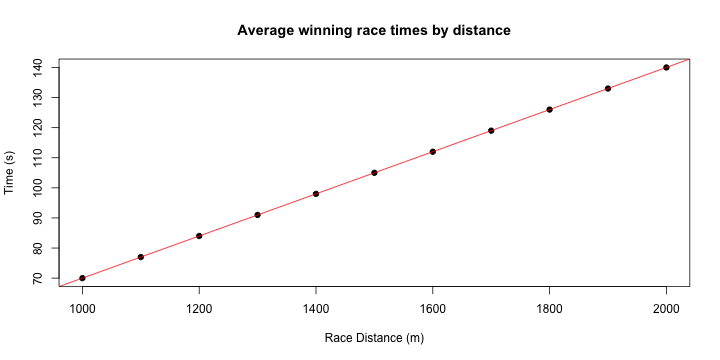

---
title       : Race Horse Prediction
subtitle    : Using linear regression to predict horse race outcomes
author      : Ian McCarthy
job         : SAP Consultant
framework   : io2012        # {io2012, html5slides, shower, dzslides, ...}
highlighter : highlight.js  # {highlight.js, prettify, highlight}
hitheme     : tomorrow      # 
widgets     : []            # {mathjax, quiz, bootstrap}
mode        : selfcontained # {standalone, draft}
knit        : slidify::knit2slides
---.class #id 
## Horse racing prediction

I would like to take this opportunity to demonstrate, using Slidify, one simple model for making race predictions, which is an area rich in data!

 
## The method used

Successful horse racing betters are able to 'read the form' of diferent horses and make predictions on how they will run against each another.

I have taken a more automated approach that uses a simple linear regression fitted to a data set of all 2013 Australian horse racing events.

It makes a prediction of how long it will take each horse to run a future race using its last race performance and the characteristics of the future race . Comparing the times of all horses in the race allows their finishing position to be predicted.


--- .class #id 
## The model's input variables

The input variables (delta of last race and future race) used in the linear regression model are as follows:

- Race distance - of course the farther the race the longer it takes to run.
- The Going - how hard (faster) or soft (slower) a track is.
- Weight - each horse carries a jockey and often an additional weight handicap


This is the general form of the R code for fitting the model and then predicting a horse's finish time:


```r
prediction_model <- lm(finish_time ~ distance + weight + going, data = aust_races_2013)

predicted_time <- (prediction_model, data = horses_last_race)
```
The outcome of this is not shown.

--- .class #id 
## The effect of distance on average winning times


```r
dist <- seq(1000, 2000, by=100)
time <- 0.070*dist
plot(dist, time, main="Average winning race times by distance", 
     xlab="Race Distance (m)", ylab="Time (s)", pch=19)
abline(lm(time~dist), col="red")
```

 

--- .class #id 
## The web app

I have created a web app based on the described model which can be viewed here: https://ianmccarthy.shinyapps.io/HorseRace/ (it may be necessary to zoom out to see all the input boxes).

The web app can make predictions for up to 5 horses, the race prediction changes as data is changed.

I hope you enjoy the app.
Thank you.
